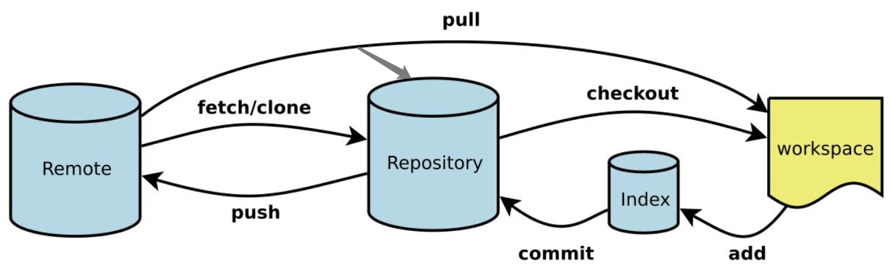
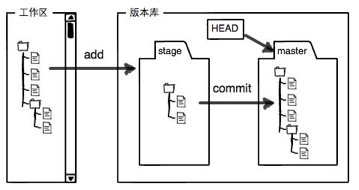
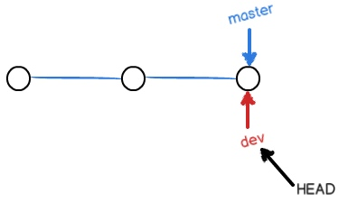
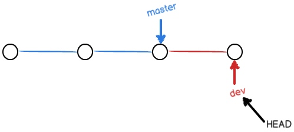
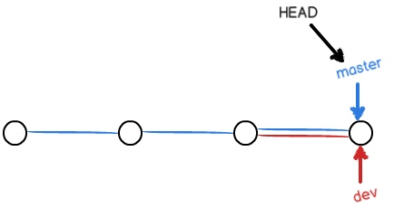
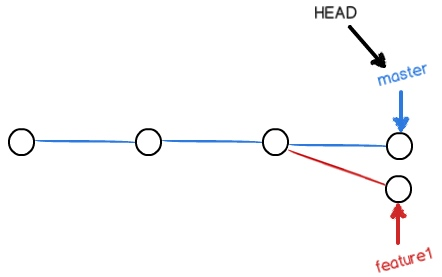
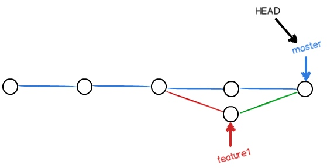

# 【devops】git

[TOC]

## 简介
git 是一个 **目前最强大的、开源的、基于快照的、分布式的版本控制系统**，能够快速高效地管理从小型到超大型项目的所有内容

git 对比 **基于差异的、集中式的版本控制系统（如 SVN）** 的优势：
- 基于快照：git 通过直接记录快照来保存数据，并不是通过记录文件差异，版本提交和回滚都会更加高效

- 分布式：每个开发者本地都存在完整的版本库，可以进行代码提交、回滚、查看历史等本地操作，后续再提交到中央版本库，而不需要一直保持连接，并且操作也更加高效

[官方网站](https://git-scm.com/) 和 [廖雪峰教程](https://www.liaoxuefeng.com/wiki/896043488029600)

### 分区和目录
git 管理数据的分区：
- 远程仓库（Remote）：远程主机上的 git 仓库，如托管在 github 上的 git 仓库

- 本地仓库：本地的 git 仓库

    - 工作区（Workspace）：直接进行修改的分区，就是除了 `.git` 子目录的所有内容
    
    - 暂存区（Index / Stage）：暂存已修改数据的分区，存在于版本库中，是 `.git/index` 子目录
    
    - 版本库（Repository）：存放已提交数据的分区，就是 `.git` 子目录



每个 git 仓库都是负责管理单个项目的目录，目录由对应项目的内容和 `.git` 子目录组成，因此将项目目录初始化为 git 仓库，实际上就是为它初始化了一个 `.git` 子目录

`.git` 子目录存储着其所在 git 仓库相关的所有对象和元信息，目录结构如下：
``` bash
.git
|-- HEAD         # 指向当前分支的指针，分支头部指针所指向的提交代表该分支的版本
|-- config       # 项目配置信息
|-- description  # 项目描述信息
|-- hooks/       # 默认的钩子脚本目录
|-- index        # 索引文件，即暂存区
|-- logs/        # 每个 refs 的历史信息
|-- objects/     # 本地仓库的所有对象
`-- refs/        # 指向各个分支、标签的指针
```

### 内容提交
git 仓库中的文件分为三种状态：
- 已修改（modified）：文件被修改了，仍处于工作区
- 已暂存（staged）：文件被修改了，已加入暂存区
- 已提交（committed）：文件已经被保存到版本库

内容提交的工作流程为：
- 在工作区修改文件
- 将想要下次提交的文件选择性地添加到暂存区
- 提交暂存区的文件到版本库

提交操作的过程：
- 将已修改内容的快照永久性存储到版本库中
- 根据所有内容生成 SHA-1 散列值，作为本次提交的 commit id
- 将 HEAD 指向本次提交，严格来说是将当前分支的头部指针指向本次提交，而 HEAD 指向当前分支



## 常用操作
### 帮助和配置
``` bash
# 获取 git 使用帮助
git help

# 获取 git 子命令使用帮助
git help ${command}

# 查看 git 配置信息
git config --list

# 配置对当前 git 仓库使用的用户名和邮箱
# --global 配置作用于全局，即对所有 git 仓库生效
git config user.name ${username}
git config user.email ${email}
```

### 获取本地仓库
``` bash
# 有两种方式：
# 1、将项目目录初始化为本地仓库，需要手动关联远程仓库
cd ${project}/
git init

# 2、克隆远程仓库为本地仓库，自动关联远程仓库
# git 支持多种协议如 https、ssh 的 ${remote_url}，但 ssh 的速度最快
git clone ${remote_url}
```
> git clone 会自动关联远程仓库并命名为 origin，并拉去远程仓库中的所有分支，分支对应命名为 `remotes/origin/${branch}`，其中 `remotes/origin/HEAD` 为远程仓库默认分支，指向 `orgin/master`（等价于 remotes/origin/master）

### 提交内容
``` bash
# 查看本地仓库状态，可以得到以下信息：
# 1、当前分支
# 2、未添加到暂存区的已修改内容
# 3、已添加到暂存区的已修改内容
git status

# 查看指定文件在工作区和暂存区之间的差异
git diff ${path} 

# 查看指定文件在工作区和版本库指定提交间的差异
# ${commit} 可以是 HEAD 也可以是 commit id
# HEAD 为当前提交，HEAD^ 为上一个提交
# HEAD^^ 为上两个提交，HEAD~N 或 HEAD@{N} 为上 N 个提交
# -- 表示之后的内容都被视为目录或文件
git diff ${commit} -- ${parh}

# 查看指定文件在暂存区和版本库指定提交间的差异
git diff --cached ${commit} -- ${path}

# 添加工作区的内容到暂存区
git add ${path}

# 提交暂存区的内容到版本库
git commit -m ${comment}
```

### 版本回滚
``` bash
# 查看版本库的提交记录
# –pretty=oneline 表示只显示 commit id 和备注
git log --pretty=oneline

# 查看所有分支头部指针的指向变更记录
git reflog

# 回退版本
# 回退版本后，${commit} 的值必须用 commit id 来回退较新的提交
# 而 git log 无法查看较新提交的 commit id，需要用 git reflog 来查看
git reste --hard ${commit}
# 影响回滚程度的参数：
# --soft    仅将 HEAD 指向指定的提交
# --mixed   在 --soft 基础上，将暂存区更新为指定的提交，默认程度
# --hard    在  --mixed 基础上，将工作区更新为指定的提交
```

### 删除和撤销
``` bash
# 删除工作区的内容，并添加该操作到暂存区
git rm ${path}

# 删除添加到暂存区的内容
git rm --cache ${path}

# 撤销工作区没有暂存的修改内容
git checkout -- ${path}

# 对于 rm 操作的文件删除，由于只影响了工作区，可以直接使用 git checkout 撤销
# 对于 git rm 操作的文件删除，由于同时影响了工作区和暂存区，需要使用 git reset --hard 来回退，会丢失最近一次提交后所修改的内容

# 对于文件添加修改，由于只影响了工作区，可以直接使用 git checkout 撤销
# 对于文件添加修改且暂存，由于同时影响了工作区和暂存区，可以先使用 git rm --cache 删除暂存区的内容，再使用 git checkout 撤销
```
> 在 git 2.23 版本后，git switch 和 git restore 代替 git checkout 的功能，前者负责切换分支，后者负责撤销内容

### 远程仓库
``` bash
# 添加远程仓库并命名为 origin，origin 是 git clone 使用的默认远程仓库名
# 使用 ssh 不仅速度快，而且可以利用公钥进行认证，无需像 https 每次都需要输入验证
git remote add origin ${remote_url}

# 查看远程仓库及其权限
# fetch 表示有提取代码权限，push 表示有推送代码权限
git remote -v 

# 删除远程仓库
git remote rm ${remote_name}

# 推送内容到指定远程仓库 origin 的 master 分支
# -u 表示当前分支对远程仓库分支进行上游关联，后续再次使用 git pull、git push 时可以简化命令
git push -u origin master

# 从远程仓库 origin 的 master 分支拉取内容，并合并到当前分支
git pull -u origin master
# 远程分支:本地分支 可合并到指定本地分支
git pull origin master:dev

# 当前分支对指定远程仓库分支进行上游关联
git branch --set-upstream-to=${remote_branch}
```

### 标签管理
``` bash
# 创建标签，无 ${commit} 时默认使用 HEAD
git tag ${tag_name} ${commit}

# 查看所有标签
git tag

# 删除指定标签
git tag -d ${tag_name}

# 推送指定标签到远程仓库
git push origin ${tag_name}

# 推送所有未推送的标签到远程仓库
git push origin --tags

# 从远程仓库删除指定标签
git push origin :refs/tags/${tag_name}
```

## 分支管理
### 分支操作
``` bash
# 查看本地分支和当前分支
# -a 查看所有分支，包含远程分支
git branch

# 创建分支
# 初始化 git 仓库时会自动创建 master 分支，也就是主分支
git branch ${branch}

# 切换分支，即切换 HEAD 指向的分支
# -b 表示先创建分支再进行切换
git checkout ${branch}

# 合并指定分支到当前分支
# 如果合并过程是直接把当前分支指向指定分支的当前提交，则称为快进模式（Fast-forward）合并
# 快进模式合并的速度很快、无需备注，但 git log 无法查看分支合并历史
# --no-ff 可以禁用快进模式合并，当前分支会指向一个新提交，后续可以查看分支合并历史
git merge ${branch} -m ${comment}

# 删除分支
# -D 强制删除未合并的分支
git branch -d ${branch}

# 查看指定分支（包括远程分支）对比当前分支的文件差异
# 接上 -- ${path} 可以比较指定文件
git diff ${branch} 

# 查看分支 2 对比分支 1 的文件差异
git diff ${branch1} ${branch2}
```

### 分支结构

仅有单个分支：


创建 dev 分支：


在 dev 分支进行一次新的提交：


合并 dev 分支到 master：


删除 dev 分支，分支结构如下：


### 冲突解决

当 master 分支和 feature1 分支各自都分别有新提交，分支结构如下：



若两个提交都对同一文件进行过修改，则分支合并后将发生冲突，冲突的文件显示如下：
``` bash
<<<<<<< HEAD
it is old_content
=======
it is new_content
>>>>>>> feature1
```

手动修改解决文件冲突，再次提交
``` bash
git add ${path}
git commit -m "conflict fixed"
```
<br>
解决冲突后，分支结构如下：


``` bash
# 查看分支合并结构图
git log --graph --pretty=oneline
```
结果如下：
```
*   c0dfce6f1ed9eb3f157da9ab4d6cdcc2bf1f124a conflict fixed
|\  
| * ab530888dbfcd4c2d6f78cf1ff7d453c31f99598 feature commit_1
* | f0169b10358c6646dd1d2bab961a457be846f9f2 master commit_2
|/  
* db0688a3b8c9935c3eb5a03eedfc52fae8f883f6 master commit_1
```

### BUG 修复
当开发过程中需要修复 BUG 时，可以先把当前分支的修改储存起来，然后新建临时分支来完成 BUG 修复，最后再恢复之前存储起来的修改

``` bash
# 存储当前分支工作区和暂存区的修改
git stash
git stash save ${comment}

# 查看所有的储存
git stash list

# 查看储存的修改详情，无 ${stash} 时默认是最近的存储，即 stash@{0}
git stash show ${stash}

# 应用存储，无 ${stash} 时默认是最近的存储，即 stash@{0}
git stash apply ${stash}

# 删除存储，无 ${stash} 时默认是最近的存储，即 stash@{0}
git stash drop ${stash}

# 应用并删除存储，无 ${stash} 时默认是最近的存储，即 stash@{0}
git stash pop ${stash}

# 清除所有存储
git stash clear
```

当在 master 分支完成 BUG 修复后，由于 dev 分支是在修复前创建的，因此也存在 BUG，这时 dev 也需要完成一次这个提交以修复 BUG
``` bash
# 复制指定提交的修改到当前分支，并完成提交
git cherry-pick ${commit}
```

## 自定义功能
### 忽略文件
通过在 git 仓库目录下添加 `.gitignore` 文件可以设置让 git 忽略不进行管理的文件

通常需要忽略的文件：
- 操作系统自动生成的文件
- 编译生成的中间文件、可执行文件
- 带有敏感信息的配置文件

[.gitignore 官方样例](https://github.com/github/gitignore)

### 命令别名
通过修改在 git 仓库目录下的 `.git/config` 文件，可以为 git 命令设置别名，以简化操作

修改样例：
``` ini
[alias]
    co = checkout
    ci = commit
    br = branch
    st = status
    last = log -1
```
