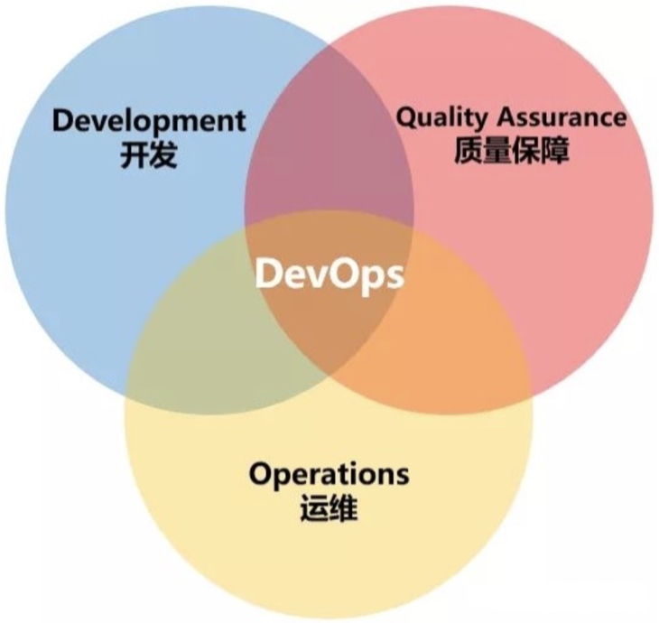

# 【devops】实践方案

[TOC]

## 简介
devops 是一套通过各类工具实现的 **自动化流程**，确保整个 **从代码开发到服务上线** 的过程中，**开发（Dev）、测试（QA）和运维（Ops）** 能够高效地协同工作

根据 devops 自动化流程的生命周期，可以分为以下阶段：
- 持续集成（Continuous Integration）

    持续完成从提交代码，编译构建，单元测试，合并分支
    核心是保证得到一份可集成的代码
    
- 持续交付（Continuous Delivery） 

    在持续集成的基础上，持续完成合并分支编译构建，类生产环境部署程序，集成测试，存入程序版本库
    核心是保证得到一个可部署的程序

- 持续部署（Continuous Deployment）

    在持续交付的基础上，持续完成生产环境部署程序，服务上线，监控追踪
    核心是保证得到一个可对外的服务

> 持续 XX 就是指：一直处于准备状态，随时可以触发 XX 动作

对于持续部署这个最高阶段，被缩写为 **CI/CD**

