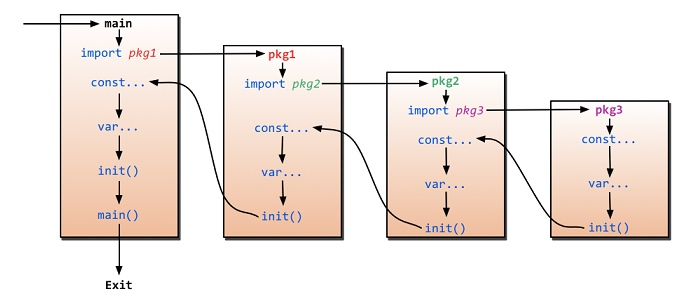
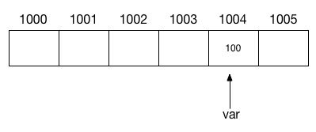
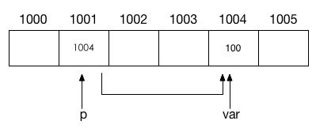
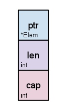
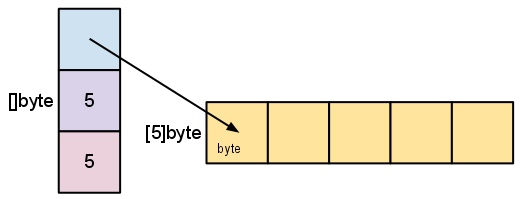
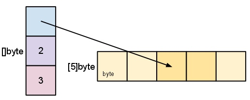

# 基础知识

[TOC]

## 简介
golang 是由 google 开发的一门开源的 **静态编译型的强定义类型** 语言，旨在创造一门具有静态编译型语言的 **高性能** 和动态解释型语言的 **高效开发** 之间的良好平衡点

[官方网址](https://golang.google.cn)
[线上测试平台](https://play.golang.org)

### 主要特性
- 自动垃圾回收 
- 更丰富的内置类型 
- 函数多返回值 
- 错误处理 
- 匿名函数和闭包 
- 类型和接口 
- 并发编程 
- 反射 
- 语言交互性

[后续补充链接](https://blog.csdn.net/michael_kong_nju/article/details/45423197)

### 安装
[官方下载地址](https://golang.org/dl/)
1. 下载匹配操作系统的官方二进制安装包
2. 解压并移动到指定目录 `${prefix}`
3. 将 `${prefix}/bin` 添加到 `PATH` 环境变量
4. 安装完成，可使用命令行工具 go 执行所需的操作

### 常用命令
``` sh
go help $command

查看子命令的帮助文档
```

``` sh
go env

查看 go 当前使用到的环境变量，其修改方式和其他环境变量一致

常用环境变量:
GOPATH   工作区目录绝对路径
GOBIN   可执行文件目录的绝对路径
GOROOT  编译程序安装目录的绝对路径
```

``` sh
go get $flags $packages

下载由导入路径指定的包及其依赖，然后进行编译和安装

flags:
-d  下载后不进行编译和安装
-u  更新包及其依赖，默认只会下载缺失的包及其依赖，不会更新
-v  显示下载的详细信息
```
对于 `golang.org/x/...`  的包无法通过该命令进行下载，可以通过 `git clone https://github.com/golang/...` 下载后移动到 `${GOPATH}` 的对应位置中

``` sh
go run $packages

编译指定的 main 包，可以是 go 源码文件，也可以是包的导入路径或者目录路径，并且执行该编译结果
```

``` sh
go build $packages

编译由导入路径指定的包及其依赖，但不安装编译结果，除非是 main 包，会生成可执行文件到当前目录
```

``` sh
go install $packages

编译由导入路径指定的包及其依赖，并且安装编译结果到指定目录，依赖包会产生归档文件，mian 包会产生可执行文件
```

### 工作区目录结构
``` sh
|-- ${GOPATH}
|   |-- bin         存放可执行文件
|   |-- src         存放源码文件，以包的形式组织
|   |-- pkg         存放在安装后的包的归档文件（.a为后缀的文件）
```

## 基础
### 包（package）
包用于组织 go 源代码，提供了更好的可重用性与可读性，每个程序是通过包构成的

每个 go 文件开头都必须包含 package 语句，以声明该文件的所属包的包名
``` go
// 包声明语句
package name
```

main 是 go 预留的特殊包名，需要编译生成可执行程序的源码，必须包含 main 包，并且 main 包下必须有且只有一个 main 函数，该函数就是程序的执行入口
 
同一个目录路径下只能存在一个包，一个包可以由多个源码文件组成

所有包都可以包含 init 函数，init 函数不应该有任何返回值类型和参数，在代码中也不能显式地调用它，但包在初始化时会自动调用

包的初始化顺序
1. 导入并初始化依赖包
2. 初始化包级别的常量和变量
3. 调用 init 函数，一个包可以有多个 init 函数（在一个文件或分布于多个文件中），它们按照编译器解析它们的顺序进行调用
4. 如果是 main 包，最后会调用 main 函数

### 导入（import）
import 语句用于导入当前代码所依赖的包
``` go
// 两种导入语句格式
import "packagePath1"
import "packagePath2"
    
import (
    "packagePath1",
    "packagePath2"
)
    
// 导入包中的名字到当前代码
import . "packagePath"
    
// 导入并别名包名
import aliasName "packagePath"
    
// 不导入包中的名字，仅执行其 init 函数
import _ "packagePath"
```
> packagePath 不仅可以本地导入路径，也可以使用远程导入路径，如 'github.com/user/package'

导入没有在代码中用到的包，编译时是会报错的
``` go
// 开发阶段，可以通过空白符屏蔽报错
import "packagePath"
var _ = package.name
```

import 语句指定的是包的导入路径，和引用时的包名没关系
> 引用时的包名应该是该包使用 package 语句声明的包名，按照约定，一般导入路径的最后目录名和包名保持一致

在导入一个包时，只能引用其中已导出的名字，任何未导出的名字在该包外均无法引用
> 包的导出定义，其中的名字如果是以大写字母开头的，那么该名字是已导出的，否则是未导出的

编译时的 import 执行过程：

1. 先找到 main 包，然后开始 main 包的初始化，即按顺序导入并初始化其依赖包
2. 导入的依赖包中还存在其他依赖包，则会递归并初始化所有依赖相关的包
3. 每个包的初始化都是在完成依赖包的导入和初始化之后，再进行本包的变量初始化和执行 init 函数
4. main 包最后执行 main 函数

> 在整个编译的导入过程中，一个包被如果导入多次，实际上只会进行初始化一次

### 变量（var）
变量就是指向了一段内存空间的一个名称，这段内存空间由 go 根据变量存储类型所分配的，用来存储具体的值

一段内存空间由一个或数个连续的存储单元组成，每个存储单元的大小为 8 bit，即 1 个字节，该内存空间地址表示为首个存储单元的地址，这个地址通常表示为一个十六进制整数



变量声明，就是指定该变量名称和存储类型，还可以指定初始值，go 会为变量分配一段内存空间并使它指向这段内存空间，如果指定了初始值，则把该初始值存入内存空间，否则会把存储类型对应的零值存入内存空间

``` go
// 变量声明
var varName Type

// 多个变量，括号写法
var (
    varName Type1
    varName Type2
)

// 声明并指定初始值
var varName Type = initialValue

// 类型推断，go 能根据指定的初始值，自动推断存储类型
var varName = initialValue

// 多个变量，存储类型相同时，指定最后一个变量的存储类型即可
var varName1, varName2 Type = initialValue1, initialValue2

// 简短声明，在函数中使用、必须有初始值，并且左边的变量至少有一个是未声明的
vName := initialValue
```
> go 是强类型语言，不允许已声明的变量被赋值为其他类型的值

使用变量进行赋值，实际上是会将原变量所指向的内存空间的存储内容，复制一份到新变量指向内存空间

内存泄漏（memory leak）和内存溢出（out of memory）
- 内存泄漏，是指程序在申请内存空间后，无法释放已申请的内存空间，导致系统无法及时回收内存并且分配给其他进程使用

- 内存溢出，指程序申请内存时，没有足够的内存供申请者使用，导致数据无法正常存储到内存中

> 内存申请考虑不周，或者多次的内存泄露，会导致内存溢出。因为系统中的内存是有限的，如果过度占用资源而不及时释放，最后会导致内存不足，从而无法给所需要存储的数据提供足够的内存

### 基本类型（type）
布尔值（bool）
- 值可以是 true 或 false 常量，零值为 false
    
字符串（string）
- 值可以是字符串常量，把内容放在双引号 "" 之间，即得到一个字符串常量，零值为 ""，也可以吧内容放在 \`\` 之间表示原始字符串，即不对字符如 \n 等进行转义
    
- 在 go 中，字符串兼容 Unicode 字符集，并且使用 UTF-8 进行编码
    
- 字符串是一个字节切片，使用索引可以获取字符串的每一个字节，但字符串是不可变的，一旦一个字符串被创建，将无法被修改，使用索引去修改其中的字符，会报编译错误

``` go
// 创建字符串并赋值
stringName := "Hello World"

// 获取字符串长度
len(stringName)
    
// 获取子字符串
subString := stringName[6:]
    
// 使用 range 迭代字符串，range 会返回索引和对应字符
for index, rune := range stringName {
    fmt.Printf(index, rune)
}
```
    
数值型
- 包括了多种类型，类型的区分主要是根据数字格式和所占位数，包括的类型如下:

|  类型 | 零值 | 说明 | 备注 |
| --- | --- | --- | --- |
| int8、int16、int32、int64、int | 0 | 有符合整型，数字表示所占位数，int 则自动根据操作系统的位数来定义所占位数 | 没有特殊需求则使用 int |
| uint8、uint16、uint32、uint64、uint | 0 |  无符号整型，数字表示所占位数，uint 则自动根据操作系统的位数来定义所占位数 | 没有特殊需求则使用 uint |
| float32、float64 | 0.0 |  浮点型，数字表示所占的位数 | |
| complex64、complex128 | 0i | 复数型，实部和虚部所占位数相等，数字表示所占两部分所占的总位数 | |
| byte | 0 | 字节类型，等价于 uint8 |
| rune | 0 | 表示一个 Unicode 代码点，等价于 int32 | 字符放在 '' 中表示一个码点 |
| uintptr | 0 | 无符号整型，自动根据操作系统的位数来定义所占的位数 | 足以容纳指针，一般在底层编程中使用 |

基本类型都是可比较的，不同类型之间的转换需要显式进行，并且不同类型之间不一定是可转换的
``` go
// 类型转换，需要声明新的变量来存储进行类型转换后的返回结果
var Type varName2 = Type(varName1)  // 等价于 varName2 := Type(varName1)

// 可进行转化的不同类型例子
var i := 42
var f := float64(i)
var u := uint(f)
```

### 常量（const）
常量表示固定的值，比如变量赋值中，可以赋予相同类型变量的值，也可以是能生成相应默认类型的常量

比如 `hello := "hello world"`，其中的 `"hello world"` 就是一个常量，是字符串常量

常量可以是字符、字符串、布尔值或数值，但这不代表常量的类型，常量通常都是没有类型的

当常量被需要类型的上下文使用时，才会生成它的默认类型，并且这个默认类型是根据使用它的上下文在运行中生成的，因此无类型的常量能赋值给有类型的变量
``` go
const a = 5
var intVar int = a
var int32Var int32 = a
var float64Var float64 = a
var complex64Var complex64 = a
```

数值常量可以在表达式中自由混合和匹配，只有当被分配给变量或者在需要类型的上下文中的任何地方使用时，才会生成默认类型
``` go
// 不同数值格式的数值常量，运算是允许的
const a = 5
const b = 0.1
c := a/b

// 不同类型的数值变量，运算是不允许的，会报编译错误
a := 5
b := 0.1
c := a/b
```

const 语句用于常量声明，使用语法类似于 var，但常量声明后不能再重新赋值为其他的值，允许声明有类型的常量
``` go
// 常量声明
const constName = initialValue

// 带类型的常量声明
const constName Type = initialValue
```
> 常量不能用 := 语法声明
> 
> 常量的初始值需要在编译时确定，因此不能将函数执行的返回值赋值给常量，因为该返回值是在运行时产生

在 go 中因为不允许混合类型，带类型的常量在分配时将一个类型的变量赋值给另一个类型的变量，即使两个类型是兼容的，无类型的常量则允许
``` go
// 创建新类型 myBool，是 bool 的别名
type myBool bool 

// 分别创建不带类型和带类型的常量
const trueConst = true
const typeTrueConst myBool= true

// 带类型的常量用于赋值时不允许混合类型
var defaultBool1 bool = trueConst // 允许
var defaultBool2 myBool = trueConst // 允许
var customBool1 myBool = typeTrueConst // 允许
var customBool2 bool = typeTrueConst // 不允许
```

iota 是常量计数器，只能在 const 语句中使用，iota 在 const 出现时将被重置为 0，可用于定义枚举
``` go
type customType int

const ( 
    ConstA customType = iota    // 0 
    ConstB                      // 1 相当于 ConstB customType = iota
    ConstC                      // 2 相当于 ConstC customType = iota
    ConstD                      // 3 相当于 ConstD customType = iota
    _                           // 使用空白符跳过一个值 4，相当于 _ customType = iota
    ConstE                      // 5 相当于 ConstD customType = iota
)
```
> 一个常量没有初始值，会沿用上一个常量的类型和初始值

### 函数（func）
对于一个已定义的函数，也就是一个变量，函数名是变量名，函数内容是变量值，func 代替函数名的函数签名分则变量的存储类型，函数也可以用于传递，比如用作函数的参数或返回值

函数签名用于表示一个函数的，包括函数名、函数形参类型和函数返回类型

func 语句用于函数定义，func 定义的命名函数是全局的，作用域为整个包
``` go
// 函数定义
func funcName(arg1 argType1 ,arg2 argType2) resultType {
    return result
}

// funcName 的函数签名
funcName(argType1, argType2) resultType

// funcName 的类型
func (argType1 ,argType2) resultType

// 定义可以接收 funcName 作为实参的函数
func funcName1(f func (argType1 ,argType2) resultType) {
    return
}
```

当在函数体中定义函数时，可以定义匿名函数，或者通过赋值的形式来定义函数，因为函数体中不允许定义全局变量，只能定义作用域为函数体的局部变量
``` go
// 以赋值的形式定义函数
funcName := func (arg1 argType1 ,arg2 argType2) resultType {
    return result
}
```

函数定义中形参和返回的其他表示形式
``` go
// 形参的类型相同，除最后一个外，其他的类型定义可省略
func funcName(arg1, arg2 argType2) resultType {
    return result
}

// 多个返回值
func funcName(arg1 argType1 ,arg2 argType2) (resultType1, resultType2) {
    return result1, result2
}

// 命名返回值，命名的名字会被视作声明在函数顶部的变量，并在函数 return 时自动返回
// 返回值的类型相同，除最后一个外，其他的类型定义可省略
func funcName(arg1 argType1 ,arg2 argType2) (result1, result2 resultType) {
    result1 = arg1
    result2 = arg2
    return
}
```
函数调用和接收返回值
``` go
// 函数调用
results := func_name(args)

// 使用空白符 _ 丢弃不需要的返回值
results, _ := func_name(args)
```

可变参数的函数定义，通过 `args ...argType` 表示可以接收任意个 argType 类型的实参，并且将这些实参转化为一个切片，赋值到形参 args

调用可变函数时，通过 `slice...` 可以将 slice 切片直接传入函数，此时 slice 会作为实参赋值到函数的可变参数
``` go
// 可变参数函数定义
func funcName(argSlice ...argType) resultType {
     for i, v := range argSlice {
        fmt.Println("index:", i, " value:", v）
     }
    return result
}

// 可变参数函数调用
results := func_name(slice...)
```
> 由于切片是引用类型，在函数中对于可变参数的切片修改，会影响传入切片的底层数组

defer 语句用于指定函数延迟调用，可以将指定的函数调用推迟到外层函数返回之后再执行，不论外层函数的执行过程是否异常
```
defer func_name(arg)
```
> 推迟的函数调用其传入的实参会立即求值，但直到外层函数返回前该调用都不会被执行
> 
> 在一个函数中使用了多个 defer 语句，这些调用会被存进一个栈中，在函数返回后，这些调用会以后进先出的顺序执行，即使某个 defer 执行异常，其他 defer 依旧会被执行

函数可以是一个闭包，当一个函数被调用时返回另一个函数，这个函数就是闭包，前者是它的外层函数，

闭包可以引用其外层函数中的变量，使得闭包和外层函数的变量关联在一起，当闭包没有被释放时，所关联的变量也能被保存在内存中
``` go
// 闭包定义
func adder() func(int) int {
	sum := 0
	return func(x int) int {
		sum += x
		return sum
	}
}

// 创建闭包，每个闭包都关联了其各自的 sum 变量
num1 = adder()
num2 = adder()

// 闭包使用
num1(1)     // 返回 1
num2(2)     // 返回 2
num1(5)     // 返回 6
num2(5)     // 返回 7
```
> 由于每个闭包都会使得关联的变量保存在内存中，因此内存消耗很大，不能滥用闭包

## 流程控制
### 循环控制（for）
for 循环语句中包括：
- 初始化语句（initialisation）：在第一次迭代前执行
- 条件表达式（condition）：在每次迭代前判断
- 后置语句（post）：在每次迭代结束执行

> 初始化语句通常是一句短变量声明，此处需要使用 :=，不允许使用 var 语句，该变量仅在 for 语句的作用域可访问
> 条件表达式结果必须为 bool 类型
> 后置语句通常是对条件表示式判断相关的变量进行操作

执行过程：
1. 先执行一次初始化语句
2. 判断条件表达式，如果为 false 则终止循环语句，否则执行循环体，在循环体结束后，执行后置语句
3. 循环上一步骤

``` go
// 循环语句用法
for initialisation; condition; post {
     // 循环体
}

// initialisation、post 是可选的
for ; condition; {
     // 循环体
}

// for 相当于 C 语言的 while 语句，因此分号也可省略
for condition {
     // 循环体
}

// 如果省略 condition，则会无限循环
// 在上面的使用中，也可以省略 condition 表示其结果为 true
for {
     // 循环体
}
```

在循环体中的循环控制语句：
- break 

    立即结束循环体，并跳出整个循环语句
- continue

    立即结束循环体，然后继续执行   

goto 无条件跳转语句，立即跳至所标记的行，然后继续执行，不仅限于在循环控制中使用 

``` go
// 标记行，标记名一般使用全大写，statement 是声明语句，允许为空
FLAGNAME: statement
    
// 使用 BREAK 来标记行，实现 break 功能
for a := 1;a < 5;a++ {
      if a == 3 {
         goto BREAK
      }
      fmt.Printf("a的值为 : %d\n", a)
   }
   BREAK: fmt.Printf("结束") 
}

// 使用 CONT 来标记行，实现 continue 功能
for a := 1;a < 5;a++ {
      if a == 3 {
         goto BREAK
      }
      fmt.Printf("a的值为 : %d\n", a)
      BREAK: 
   }
   fmt.Printf("结束") 
```
    
### 条件控制（if-else）
``` go
// 条件语句用法，else if 和 else 为可选语句
if condition1 {
    // 条件1为真
} else if condition2 {
    // 条件1为假，条件2为真
} else {
    // 条件1、条件2都为假
}

// statement 代表变量声明语句，是可选部分，会在条件判断之前运行，声明的变量仅在 if 和 else 语句的作用域可访问
if statement; condition {
    // 可访问 statement 声明的变量
} else {
    // 可访问 statement 声明的变量
}
```
> condition 表示条件表达式，其结果必须为 bool 类型，如果是 true，则表示条件判断为真
> 
> else 语句应该在 if 语句的大括号 } 之后的同一行中，否则编译器编译时会报错

### 条件控制（switch）
switch 语句是一连串 if-else 语句的简便方法

switch 执行顺序:
1. 用表达式的结果依次和各个 case 语句的期望值进行比较
2. 如果存在匹配的 case 语句，则执行首个匹配语句的代码块，否则执行 default 语句的代码块（如果有的话）
3. 结束 switch 语句

``` go
// switch 语句用法
switch expression {
    case expectValue1:
        // 表达式等于期望值1
    case expectValue2:
        // 表达式等于期望值2
    default:
        // 表达式不匹配任何期望值
}

// statement 代表变量声明语句，是可选部分，会在条件判断之前运行，声明的变量仅在 switch 语句的作用域可访问
switch statement expression {
    case expectValue1:
        // 表达式等于期望值1
    case expectValue2:
        // 表达式等于期望值2
}

// 多个期望值的 case 语句
switch expression {
    case expectValue1, expectValue2, expectValue3:
        // 表达式等于期望值1、期望值2、期望值3其中之一
    case expectValue4:
        // 表达式等于期望值4
}

// 无表达式的 switch，省略表达式时，表达式的值默认为 true，因此 case 语句中可以使用条件表达式
switch {
    case conndition1:
        // 条件1为真
    case conndition2:
        // 条件2为真
}
```
> case 语句定义的期望值不允许重复，否则编译器编译时会报错
> 
> default 语句的作用和在 switch 中的位置无关

fallthrough 语句可以在当前 case 或 default 语句的代码块执行完成后，不论表达式和期望值匹配结果如何，直接跳转到下一个 case 或 default 语句的代码块，而不是结束 switch 语句
> fallthrough 语句必须是代码块的最后一个语句，否则编译器编译时会报错
> 
> 推迟的函数调用会被压入一个栈中，当外层函数返回时，被推迟的函数会按照后进先出的顺序调用

## 更多类型
### 值类型和引用类型
- 值类型
    - 值类型变量所指向的内存空间直接存储着变量值
    
    - 值类型变量用于赋值时，新老变量的数据是独立的，其中一者修改不影响两者
    
    - 字符串、布尔型、数值型、数组、结构体
    
- 引用类型

    - 引用类型变量所指向的内存空间，存储着以某种结构存在的指针，指针所指向的内存空间才存储着对应的底层值
    
    - 引用类型变量用于赋值时，新老变量的数据都是引用自同一个内存空间，其中一者修改会影响两者

    - 指针、切片、映射、信道
    
    - 引用类型的零值为 nil，即所指向的内存空间中存储的指针都指向了值为 nil 的内存空间
    
    - 当切片、映射、信道为 nil 时，不能进行值操作，因为值为 nil 的内存空间不支持操作，而 go 又不会为引用类型变量所指向的内存空间中存储的指针自动分配新的内存空间，因此需要使用 make 函数来显式申请分配，来创建能进行值操作的引用类型变量
        
        make 函数会为引用变量所指向的内存空间中存储的指针申请分配内存空间，并且返回指定类型本身    
    ``` go
    mapName = make(mapType)
    ```

### 指针（pointer）
指针存储了一个指定存储类型的内存空间地址，通常表示为一个十六进制整数，也可以说指针引用了这段内存空间



指针是引用类型，其零值为 `nil`，即没有引用任何内存空间，此时可以被赋值为其他符合存储类型的内存空间地址（通过对其他变量进行取址操作得到），来对其他变量进行引用

``` go
// 指针变量声明
// 变量存储 Type 类型的内存空间地址
var ptrName *Type

// 指针变量赋值，对其他变量进行引用
// & 取址操作符会返回所操作变量的内存空间地址
i := "hello"
ptrName = &i

// 通过指针变量间接修改所引用的变量
// * 取值操作符会返回所操作指针所引用内存空间的存储值，也叫指针的解引用
*ptrName = "hi"
```
> 不同存储类型的指针不能互相转化，如 *Type1 和 *Type2 之间值不能转化
> 
> 指针不能进行运算
> 
> 不要向函数传递数组的指针，不是符合惯用的实现方式，应该使用传递切片来实现

不能对值为 `nil` 指针直接进行解引用，如果希望使用一个新声明的指针来存储值，有两种方法：

第一种方法，先使用 `new` 函数申请一块内存空间，并将该内存空间地址赋值到指针
``` go
// new 函数签名
func new(Type) *Type

// 实现例子
var ptrName *Type
ptrName = new(Type)
*ptrName = value
```
> new 函数会分配指定类型内存存储单元，并返回一个指向该内存存储单元的指针

第二种方法更简便，在声明时指定初始值，使指针直接引用常量的内存空间
```
ptrName := &value
```

### 结构体（struct）
结构体存储了一个包含一系列有不同名字和存储类型的字段（field）的组合
``` go
// 结构体类型定义
type structType struct {
	field1 Type1
	field2 Type2
}

// 包含匿名字段的结构体类型定义，此时字段类型就是对应字段名
type structType struct {
	Type1
	Type2
}
```
结构体是值类型，其零值是所有字段值为对应字段类型零值的结构体
``` go
// 结构体变量声明
var structName structType

// 结构体变量声明指定初始值
// 通过 value-list 形式创建结构体，值与字段顺序有关，必须列出所有字段值
structName := structType{value1, value2}

// 通过 key-value 形式创建结构体，值与字段顺序无关，不需列出所有字段值，没列出的字段值会自动取对应零值
structName := structType{field1: value1, field2: value2}

// 使用匿名结构体类型创建结构体
structName := struct {
	field1 Type1
	field2 Type2
}{value1, value2}

// 通过 . 来获取结构体的字段值
structName.field1   // value1

// 通过结构体指针隐式引用结构体的字段值
p = &structName
p.field1    // value1，等价于 (*p).field1
```
> 结构体的字段名也需要以大写开头才能被导出
> 
> 只要结构体的每一个字段值都是可比较的，则该结构体也是可比较的
> 

创建类型时的值部分，即 `{}` 中的内容，存在换行必须附带 `,`
``` go
// value2 后的 , 不能省略 
varName := structType{
    field1: value1,
    field2: value2,
}
```
### 数组（array）
数组存储了一个包含一系列类型相同的值的组合，数组也可以看作是一个特殊的结构体，索引对应结构体的字段名

``` go
// 数组类型定义，类型可用于变量声明和创建数组
// 定义的类型为包含 N 个 Type 类型的值的数组
[N]Type

// 变量声明，自动创建包含多个对应零值的数组
var arrayName [N]Type

// 变量赋值，手动通过类型创建数组
arrayName := [N]Type{value1 ,... ,valueN}

// 创建数组实例时，通过 ... 自动计算数组长度，生成数组类型
arrayName := [...]Type{value1 ,... ,valueN}

// 通过 [index] 来引用数组中的值，index 从0开始
arrayName[N]    // valueN

// 获取数组长度
len(arrayName)
```
> 数组的长度是其类型的一部分，因此数组不能改变大小

数组的其他使用：
``` go
// 使用 range 迭代数组，range 会返回索引和对应值
for i, v := range arrayName {
    // 循环体
}

// 迭代数组时，不需要索引，使用空白符 _ 丢弃
for _, v := range arrayName {
    // 循环体
}

// 二维和多维数组
// 一个包含 N 个 M 长度的 Type 类型元素的数组的数组
[N][M]Type
```

创建复杂类型的数组时，数组的值部分中，只需要填多个该复杂类型值部分即可
``` go
arrayName := [N]Struct{
    {value11, value12},
    ... ,
    {valueN1, valueN2},
}
```

### 切片（slice）
每个数组的大小都是固定的，切片则为数组元素提供动态大小的、灵活的视角。切片本身不拥有任何数据，它们只是对底层数组的引用

切片的结构如下:
- ptr 切片的元素，是多个指向底层数组的元素所在内存存储单元的指针
- len 是切片的长度，是切片中的元素数
- cap 是切片的容量，是底层数组从创建切片索引开始到末尾的元素数


> 切片的零值为 nil，即长度和容量为 0 且没有引用的底层数组

``` go
// 获取切片长度
len(sliceName)

// 获取切片容量
cap(sliceName)
```

切片的创建
``` go
// 切片类型定义
// 一个元素类型为 Type 的切片类型
[]Type

// 使用切片类型创建切片，在附带元素初始值时，会内部自动创建数组，然后再创建引用该数组的切片
sliceName := []byte{'', '', '', '', ''}

// 通过切片底层数组来创建切片
arrayName := [5]byte{}
sliceName := arrayName[:]   // 等同 var []byte = arrayName[:]

// 使用 make 函数创建切片
make([]Type, len, cap)
// 该函数会内部自动创建一个元素类型为 Type，元素值为零值的数组，并返回一个引用该数组的，并且长度为 len，容量为 cap 的切片
// cap 为可选，默认和 len 相等
sliceName := make([]byte, 5)
```
创建的切片结构如下:


> 切片数组通过 `[startIndex:endIndex]` 来界定一个半开区间，包括了第 startIndex 个元素，但排除第 endIndex 个元素
>
> startIndex、endIndexstart 都为可选，前者默认为 0，后者默认为数组长度

切片的重新切片
``` go
// 在容量的限制之内
// 可以进行重新切片来向后调整切片的长度，容量不变
sliceName = sliceName[:1]   // 调整后长度为2，容量为5
sliceName = sliceName[:4]   // 调整后长度为4，容量为5

// 也可以对向前舍弃切片中的元素，长度和容量减少
sliceName = sliceName[2:]   // 舍弃切片前两个元素，舍弃后长度是2，容量减少2，是3
```

重新切片后的切片结构如下:

切片的修改:
``` go
// 切片修改也是通过 [index] 来引用切片中的值
// 切片是对底层数组的引用，修改直接会影响底层数组
sliceName[1] = 2  
```
利用切片来实现动态数组：
``` go
// 切片复制
// 将 srcSlice 切片底层数组的元素复制到 dstSlice 切片的底层数组，返回复制元素的数目
// 不同长度的切片之间的复制，只复制较短切片的长度个元素
// dstSlice 底层数组将被影响
copy(dstSlice, srcSlice)

// 切片动态追加相同类型的元素
sliceName = append(sliceName, value, ...)

// 切片动态追加相同类型的切片
// slice... 可将切片直接传入函数，作为实参赋值到可变参数
sliceName = append(sliceName, appendSlice...)
```
> append 函数的执行过程:
> 1. 创建追加元素切片 appendSlice，长度为 n
> 2. sliceName 的长度为 m、容量为 c，
> 3. appendSlice 和 sliceName 两者的总长度为 n+m 
> 4. 若 n+m <= c，则复制 appendSlice 到 sliceName[m:m+n]
> 若 c < n+m < 2c ，则先创建 2*c 容量的 newSlice，若 n+m > 2c，则先创建 n+m 容量的 newSlice
然后复制 sliceName 到 newSlice[:m]，复制 appendSlice 到 sliceName[m:m+n]
最后返回 newSlice[:m+n]
> 
> 若 n+m <= c，sliceName 的最初底层数组将受到影响
> 否则由于 newSlice 的创建，内部创建了新的底层数组，最初底层数组不会受到影响

内存浪费陷阱以及优化：
由于切片对底层数组一小部分数据的引用，导致内存需要保存底层数组的所有数组

例如，FindDigits 函数加载整个文件到内存，然后搜索首个连续的数字，以切片返回。这个切片会导致内存中需要保存整个文件的数据
``` go
func FindDigits(filename string) []byte {
    b, _ := ioutil.ReadFile(filename)
    digitRegexp := regexp.MustCompile("[0-9]+")
    return digitRegexp.Find(b)
}
```
通过 append 或者 copy 进行修复，使返回的切片引用的是新的底层数组，而非包含整个文件数组的底层数组
``` go
func FindDigits(filename string) []byte {
    b, _ := ioutil.ReadFile(filename)
    digitRegexp := regexp.MustCompile("[0-9]+")
    b = digitRegexp.Find(b)
    return append([]byte{} ,b...)
    // 通过 copy
    // c := make([]byte, len(b))
    // copy(c, b)
    // return c
}
```
切片和数组进行函数传递的区别，函数传递时会进行形参的赋值
由于前者是引用类型，函数中的修改会影响传入切片的底层数组，后者是值类型，函数中的修改不会影响传入数组

切片的迭代和二维或多位切片使用方式与数组一致

### 映射（map）
将键（key）映射到值（value）的类型，通过键可以获取对应的值
> 映射的零值为 nil，nil 映射既没有键，也不能添加键

映射的创建:
``` go
// 映射类型定义
// 一个键为 keyType 类型，值为 valueType 类型的 map 类型
map[keyType]valueType

// 通过映射类型创建映射，同时初始化
// 最后的映射条目和 } 不在同一行时，需要使用 , 结尾
mapName := map[keyType]valueType{
    key1: value1,
    key2: value2,
}

// 值为定义的类型
mapName := map[keyType]valueType{
    key1: {subValue1, subValue2},
    key2: {subValue1, subValue2},
}

// 使用 make 函数创建并初始化
mapName := make(map[keyType]valueType)
```
> map 如果没有初始值，必须使用 make 函数初始化，否则零值是没有键也不能添加键的

map 中的元素
``` go
// 获取映射的长度
len(mapName)

// 添加元素
mapName[key] = value

// 获取元素
// 如果 key 不存在，则返回 value 类型的零值
value := mapName[key]

// 获取是否存在
value, ok := mapName[key]

// 删除元素
delete(mapName, key)

// 可以使用 range 迭代映射，range 返回键和对应值
for key, value := range mapName {
    fmt.Printf(key, value)
}
```

map 是引用类型，当 map 被赋值为一个新变量的时候，它们指向同一个内部数据结构，改变其中一个变量，就会影响到另一变量

map 之间不能使用 `==`  操作符判断，编译时会报编译错误；`==` 只能用来检查其是否为 nil

删除元素 map 占有的内存没有释放，只是修改了一个标记，`map = nil` 才能真正释放内存

## 方法和接口
### 方法（method）
方法只是一类能作用于特定类型变量的函数，这种特定类型变量叫做接收器，接收器可以在方法的内部被访问

每个方法能且只能作用于一个接收器
``` go
// 接收器名字和类型的定义在 func 和 funcName 之间
// 定义作用于 receiverType 类型的接收器的方法
func (receiverName receiverType) funcName (arg argType) resultType {
    // 函数体中可以访问接收器
    return receiverName
}

// 接收器通过 . 来对其方法进行调用
var varName receiverType = value
varName.funcName(args)
```
接收器不仅仅可以是结构体类型，还可以是其他的类型
也就是说，除了结构体之外，任何类型都可以拥有方法
``` go
type MyFloat float64

func (f MyFloat) Abs() float64 {
	if f < 0 {
		return float64(-f)
	}
	return float64(f)
}

var MyFloat f = 0.0
f.Abs()
```
> 注意接收者的类型定义和方法声明必须在同一包内，不能为内建类型声明方法

go 需要方法的原因:
- go 不是纯粹的面向对象编程语言（不支持类），基于类型的方法是一种实现的类相似的途径
- 相同名字的方法可以定义在不同的类型上，而相同名字的函数是不被允许的

除了上述作用于值接收器的方法，还可以创建作用于指针接收器的方法

两者区别在于，在指针接收器的方法内部的改变是会影响传入数据的，即该改变对于外部调用者是可见的
``` go
// 定义作用于 receiverType 指针类型的接收器的方法
func (receiverName *receiverType) funcName (arg argType) resultType {
    // 函数体中可以访问接收器
    // 如果接收器是结构体指针类型，可以隐式引用字段
    (*receiverName).field = value   // 等同 receiverName.field = value
    return
}

// 接收器通过 & 获取其指针，通过 . 来对其方法进行调用
// 可以进行隐式引用
var varName receiverType = value
varName.funcName(args)   // 等同 (&varName).funcName(args)
```
> 当内存拷贝一个结构体的代价过于昂贵时，使用指针接收器可以不拷贝结构体的值，只拷贝其指针到方法内
> 
> 无论是指针接收器还是值接收器的方法，由于 go 的隐式调用，都可以通过指定类型的指针或者值进行调用

结构体的匿名字段的方法可以被结构体直接调用
``` go
type address struct {
    city  string
    state string
}

func (a address) fullAddress() {
    fmt.Printf("Full address: %s, %s", a.city, a.state)
}

type person struct {
    name string
    address
}

func main() {
    p := person{
        name: "Elon",
        address: address {
            city:  "Los Angeles",
            state: "California",
        },
    }

    p.fullAddress() // 可访问 address 结构体的 fullAddress 方法
```

### 接口（interface）
接口是由一组方法签名（Method Signature）定义的集合，接口指定了一个类型应该具有的方法，而类型指定了这些方法的具体实现
> 方法签名和函数签名一样，描述了一个方法的名字、形参类型以及返回类型
> 如：example(string, []byte) int

当一个类型为接口类型中的所有方法提供了定义时，即这个类型实现了该接口

接口类型的变量可以接收实现了该变量的类型的值

``` go
// 接口类型的定义，接口中定义了 funcName 方法签名
type InterfaceType interface {  
    funcName() resultType
}

// 为 Type 类型实现该接口类型
// 提供定义即可，无须显式声明
func (receiverName Type) funcName() resultType {
    return result
}

// 利用接口来调用方法
var v Type = value
var i InterfaceType = v
i.funcName()
```
接口类型本身不区分值类型和引用类型，一个接口被赋值后，内部会存储该所赋的值和类型，此时所赋值是值类型，该接口就是值类型，接口调用方法时会执行所赋值的类型的同名方法

接口的零值为 nil，即没有值也没有类型，为零值接口调用方法会产生运行错误

利用接口可以实现面向对象编程的多态特性，一个接口，多种实现
``` go
// 当 Type1、type2 和 Type3 同时实现了接口 InterfaceType，接口中定义了 funcName 方法
// 可以通过 InterfaceType 类型的切片，可以迭代对不同类型的变量进行统一方法调用，却运行不同的方法实现
varName1 Type1 = value1
varName2 Type2 = value2
varName3 Type3 = value3

for _, i = range []InterfaceType{varName1, varName2, varName3} {
    i.funcName()
}
```
> 使用接口来调用方法，因为接口是值类型，因此没有隐式调用，接口类型中定义的方法会严格区分接收器是值类型和指针类型

没有包含方法的接口类型 `interface{}` 成为空接口类型，因此所有类型都实现了空接口
``` go
// 任何类型的值都可以传参给空接口类型形参
func funcName(arg interface{}) resultType {
    return result
}
 
// 空接口可以被收任何类型的返回值所赋值
varName interface{} = func funcName() interface{} {
    return result
}
```

类型断言提供了判断和访问接口底层值的方式
``` go
// 断言 interfaceName 接口的底层类型为 Type，若是则将底层值赋值给 varName，否则触发恐慌
varName := interfaceName.(Type)

// 接收断言是否成功的结果，不触发恐慌
// 若断言失败，varName 为 nil，ok 为 false
varName, ok := interfaceName.(Type)
```
类型选择用于按顺序将接口的底层类型与很多类型进行比较 ，与 switch 语句相似，但 case 语句的期望值为类型（而非值）
``` go
switch interfaceName.(type) {
case Type1:
    // interfaceName 的底层类型为 Type1
case Type2:
    // interfaceName 的底层类型为 Type2
default:
    // 没有匹配
}
```
还可以将一个接口的底层类型和接口相比较，如果该底层类型实现了接口，则两者是匹配的
``` go
// 可以在 switch 语句中进行赋值
switch varName := interfaceName.(type) {
case interfaceType1:
    // interfaceName 的底层类型实现了 interfaceType1 接口
case interfaceType2:
    // interfaceName 的底层类型实现了 interfaceType1 接口
default:
    // 没有匹配
}
```

接口嵌套可以实现面向对象编程的继承特性
``` go
type interfaceType1 interface {  
    funcName1() Type
}

type interfaceType2 interface {  
    funcName2() Type
}

type interfaceType3 interface {  
    interfaceType1
    interfaceType2
}
```