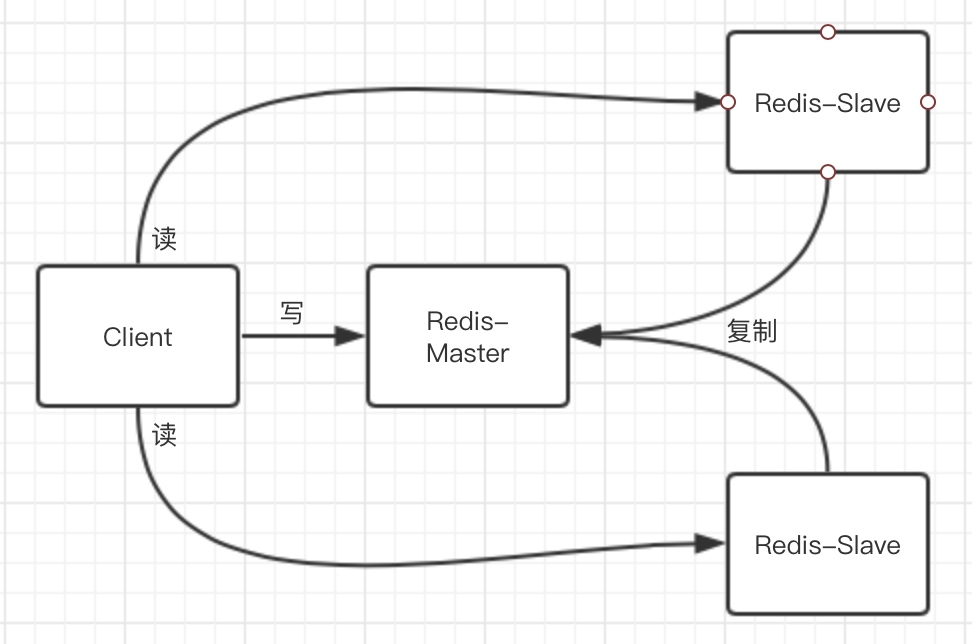
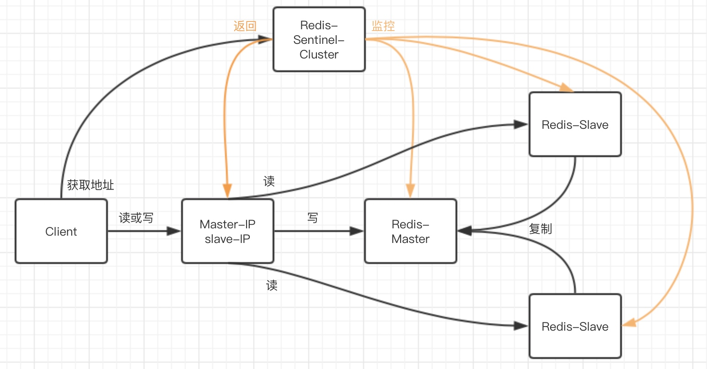
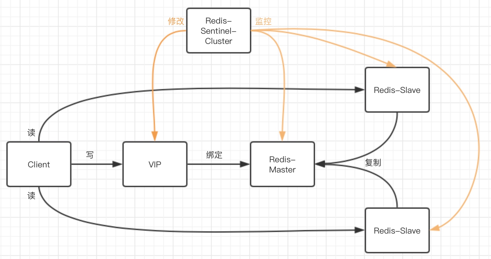
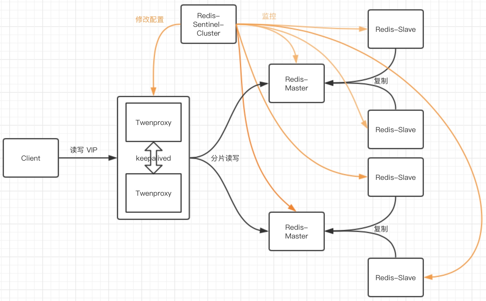
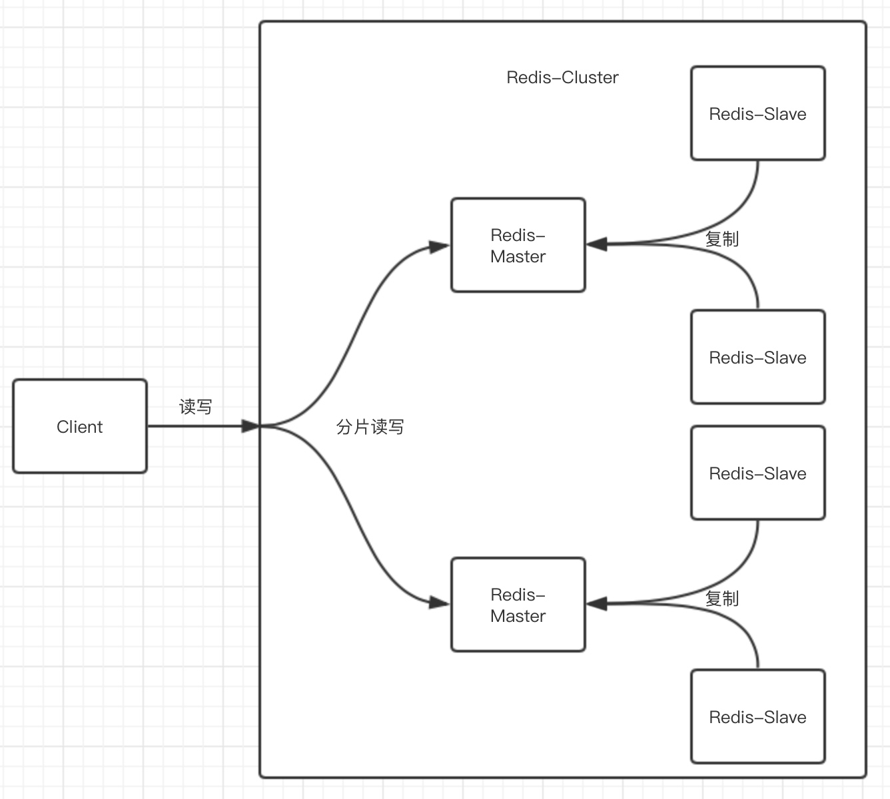
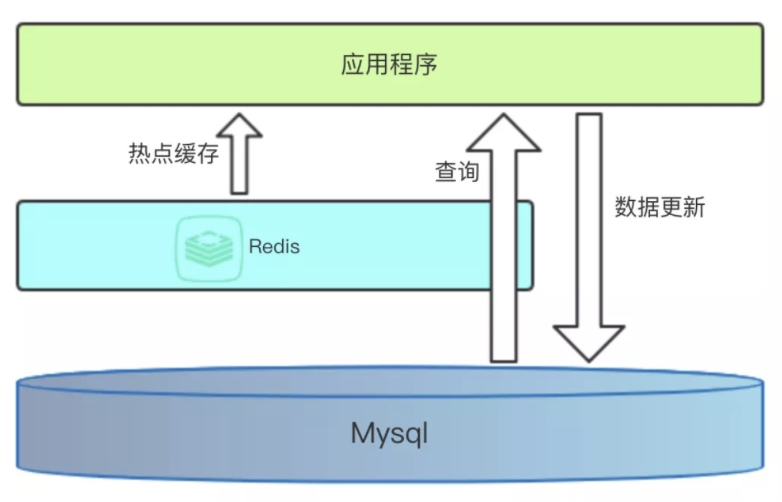

# 【redis】基础

[TOC]

## 简介
redis 全称为 **远程字典服务（Remote Dictionary Server）**，是一个 **开源的、高性能的、基于内存的非关系型数据库（Nosql）**，具有以下特点：
- 数据以键值对（Key-Value）形式存在，并支持多种数据结构的值（Value）
- 线程安全的原子性操作，可实现事务，并且不需要自行保证线程安全
- 支持数据持久化，可以保存内存数据到磁盘，以及加载磁盘数据到内存
- 支持主从复制，可以实现多个热备节点

可用作 **数据库**、**缓存代理** 和 **消息队列代理**

[官方网站](https://redis.io) 

### 高性能
redis 具有高性能的原因：
- 绝大部分请求是完全基于内存的操作，非常快速
- 各种数据结构的底层对象以及其操作的实现方法，都设计得很高效
- 采用单线程，避免了由多进程或者多线程带来的上下文切换和竞态条件
- 基于事件驱动模式、协程、多路复用 IO 模型，实现高并发能力

### RESP
RESP（Redis Serialization Protocol），即 redis 序列化协议，是其客户端和服务端之间的通信协议，具有以下特点：
- 易实现、解析快、可读性高
- 报文支持整数、单行回复、数组、错误信息、多行字符串多种类型的数据
- 通过报文的首个字节来判断其数据类型

## 数据结构
数据是以键值对（Key-Value）形式存在，其中键（Key）一定字符串（string），而值（Value）则支持以下多种数据结构

### 字符串（string）
string 是 redis 最基本的数据类型，值的最大长度是 512 MB

string 是二进制安全的，也就是说 string 可以存储任何数据，包括图片、视频、二进制程序等

### 哈希（hash）
hash 是一个 string 类型的 key 和 value 的映射表，适合用于存储对象，最多可存储 232-1（40多亿）个键值对

### 列表（list）
list 是一个 string 类型的有序列表，按照元素的插入顺序进行排序，最多可存储 232-1（40多亿）个元素，元素是可重复的

### 集合（set）
set 是一个 string 类型的无序集合，最多可存储 232-1（40多亿）个元素，元素是不可重复的

set 是通过哈希表底层数据结构实现的，添加、删除、查找的时间复杂度都是 $O(1)$

### 有序集合（zset）
zset 是一个 string 类型的有序集合，最多可存储 232-1（40多亿）个元素，元素是不可重复的

zset 中每个元素都会关联一个 double 类型的分数（score），并且按照分数从小到大进行排序，分数是可以重复的

## 持久化
redis 支持数据持久化，运行时可以保存内存数据到磁盘，以及启动时可以加载磁盘数据到内存，其中包括两种持久化方式：RDB（Redis DataBase）和 AOF（Append-Only File）

### RDB
RDB 是一种快照式的持久化方式，会将某一时刻的数据持久化到磁盘的 RDB 文件中，RDB 文件后缀为 `.rdb`，是默认的持久化方式


相关的 redis 源码核心功能函数：
- `rdbSave` 用于将数据对象生成 RDB 文件
- `rdbLoad` 用于加载 RDB 文件为数据对象

可以通过 `save` 和 `bgsave` 客户端命令，来主动触发持久化，前者会阻塞服务端主进程

特性：
- redis 在进行数据持久化的过程中，会先将数据写入到一个临时文件中，待持久化过程都结束了，才会用这个临时文件替换上次持久化好的文件，因此 RDB 文件总是完整可用的，可随时来用于备份

- redis 执行 `bgsave` 时，会单独创建一个子进程来负责持久化，而主进程不会进行任何 IO 操作，因此不影响其本身的性能

- 如果需要进行大规模数据的恢复，且对于数据恢复的完整性不是非常敏感，那 RDB 要比 AOF 更高效

相关配置：
``` conf
# 时间策略，save n m 表示 n 秒内如果有 m 条写入指令，则自动触发一次持久化
save 900 1
save 300 10
save 60 10000

# RDB 文件名称
dbfilename "dump.rdb"

# RDB 文件所在目录
dir "/home/work/app/redis/data/"

# 如果子进程保存出错，主进程是否停止写入，是为了保护持久化的数据一致性
stop-writes-on-bgsave-error yes

# 是否压缩，建议没有必要开启，会带来更多的 CPU 消耗
rdbcompression yes

# 加载恢复时是否检查
rdbchecksum yes
```

### AOF
AOF 是一种记录式的持久化方式，将执行过的写指令以 RESP 协议记录到磁盘的 AOF 文件中，在数据恢复时按照从前到后的顺序再将这些指令执行一遍


相关的 redis 源码核心功能函数：
- `flushAppendOnlyFile` 用于将 AOF 缓冲区中的记录通过 `write` 系统调用追加到 AOF 文件，再根据配置通过 `fsync` 或 `fdatasync` 系统调用刷新 AOF 文件到磁盘

> 当将数据写入文件时，内核通常先将该数据复制到其中一个缓冲区中，如果该缓冲区尚未写满，则并不将其排入输出队列，而是等待其写满或者当内核需要重用该缓冲区以便存放其他磁盘块数据时，再将该缓冲区内排入输出队列，待其到达输出队列首位时，才进行实际的 IO 操作，这种输出方式被称为延迟写
> 
> 系统提供了 `sync`、`fsync` 和 `fdatasync` 三个系统调用函数来保证磁盘上实际文件系统与缓冲区的一致性
> 
> sync 只是将所有修改过的块缓冲区排入写队列，然后就返回，它并不等待实际写磁盘操作结束
> 
> fsync 只对由文件描述符指定的单一文件起作用，并且阻塞等待写磁盘操作结束，然后返回
> 
> fdatasync 类似于 fsync，但它只影响文件的数据部分，而 fsync 还会同步除数据外的文件属性

特性：
- 当 AOF 持久化方式处于打开状态时，redis 每执行完一个写命令之后，会将命令以 RESP 协议追加到 AOF 文件

- AOF 文件由于不断追加记录，如果不处理则会变得越来越大，redis 能根据配置对 AOF 文件进行后台重写，只保留可以恢复数据的最小记录集，使得 AOF 文件不至于过大

- 在进行 AOF 文件重写时，仍然是采用先写临时文件，全部完成后再替换原 AOF 文件，所以重写中断不会影响 AOF 文件的可用性

相关配置：
``` conf
# 是否开启 AOF
appendonly yes

# AOF 文件名称
appendfilename "appendonly.aof"

# AOF 文件刷新策略，影响通过 fsync 系统调用刷新 AOF 文件到磁盘的频率
# always：每写入一个命令都立即刷新 AOF 文件到磁盘，速度慢但很安全
# everysec：默认，每秒一次刷新 AOF 文件到磁盘，速度和安全都是折衷
# no：让操作系统来决定刷新 AOF 文件到磁盘的频率，速度快但不安全
appendfsync everysec

# AOF 重写期间是否不进行保存
no-appendfsync-on-rewrite no

# 重写触发的机制，设定 AOF 文件增长超过设定上次重写后大小的百分比，或者达到指定的文件大小后，才触发重写
auto-aof-rewrite-percentage 100
auto-aof-rewrite-min-size 64mb

# 加载 AOF 文件尾部出错时，是否继续加载删减后的前部，或者报错并停止执行
aof-load-truncated yes

# 文件重写后是否立即刷新到磁盘
aof-rewrite-incremental-fsync yes
```

### 两者比较
| 比较点 | RDB | AOF |
| --- | --- | --- |
| 备份类型 | 全量备份 | 增量备份 |
| 保存频率 | 低 | 高，根据策略决定 |
| 数据安全 | 差，易丢数据 | 好，根据策略决定 |
| 保存速度 | 快 | 慢，根据策略决定 |
| 耗时效率 | 低，经常要创建子进程 | 高 |
| 文件体积 | 小 | 大 |
| 适用场景 | 数据备份 | 持久化数据 |
| 恢复速度 | 快 | 慢 |
| 是否阻塞 | save 阻塞，bgsave 和自动触发不阻塞 |  即使重写中也不阻塞 |
| 优先级 | 低 | 高 |

> 保存速度：单位时间内能保存的数据量
> 耗时效率：持久化所消耗的主程序处理时间，时间越长效率越低

## 架构模式
### 单机


特点：
- 简单

缺陷：
- 内存容量有限
- 并发能力有限 
- 无法保证高可用

### 主从复制


特点：
- master 和 slave 之间数据相同
- 转交 master 的读压力给 slave

缺陷：
- 无法保证高可用
- 没有解决 master 的写压力

### 哨兵


哨兵集群（Redis-Sentinel-Cluster）是 redis 架构中非常重要的一个分布式组件，主要功能是：
- 监控：哨兵会不断地定期检查所有 master 和其 slave 是否正常工作
- 通知：若某个 redis 节点发生故障，哨兵可通过 API 向管理员或者其他应用程序发送通知
- 自动故障迁移：若 master 发生故障，哨兵会自动进行一次故障迁移操作：
    - 它会将故障 master 的其中一个 slave 升级为新的 master，并让其他 slave 改为改为复制新的 master
    - 当客户端查询 master 地址时，哨兵会向客户端返回最新的 master 地址
    - 当故障 master 恢复时，会成为新的 master 的 slave

客户端也可以直接连接 VIP，当哨兵进行自动故障迁移时通过触发脚本来为新 master 绑定 VIP



特点：
- 所有的节点都得到监控
- 保证高可用

缺陷：
- 主从切换需要时间，会丢部分数据
- 没有解决 master 的写压力

### 代理


twemproxy 是一个开源的 redis 和 memcache 轻量级单线程代理服务，实现了 Memcached 协议和 RESP 协议，主要功能是：
- 分片支持多种 hash 算法，包括 MD5、CRC16、CRC32、CRC32a 等 
- 支持失败上游自动删除
- 代理的分片逻辑对客户端透明

特点：
- 所有的节点都得到监控
- 保证高可用
- 解决了 master 的写压力

缺陷：
- 主从切换需要时间，会丢部分数据
- 架构复杂、可扩展性差以及运维成本高，故障出发脚本需要自行实现，进行扩缩容需要手动干预

### 集群


redis 集群（Redis-Cluster）采用无中心结构，每个节点保存着各自的数据，以及整个集群状态，并且连接着其他所有节点，基于 gossip 协议来交换状态信息，其工作原理：
- 客户端与集群中的任意 master 直连，不需要经过代理
- 集群中包含 16384 个哈希槽，在正常工作的时候，集群中的每个 master 都负责一部分的哈希槽
- 被连接的 master 会根据公式 `HASH_SLOT=CRC16(key) mod 16384` 计算出 key 映射的哈希槽，然后对相应的 master 进行操作

特点：
- 无需哨兵监控，如果 master 发生故障会集群内部会自动进行主从切换
- 可以进行横向扩容
- 支持自动化迁移，当出现某个 slave 发生故障，对应 master 没有 slave 了，集群会自动其他 master 的多余 slave 迁移到没有 slave 的 master 上

缺陷：
- 由于分片机制，不能正常地支持批量操作
- 资源隔离性较差，容易出现相互影响的情况

## 应用
### 缓存代理
缓存就是指将操作得到的结果存储到缓存代理中的操作，当需要再次获取这些结果时，可直接从缓存代理中获取，而不需要再次进行操作

当一个系统出现性能问题时，一般来说都是数据库的问题，为数据库加入缓存代理，将热点数据存储到缓存代理中，客户端不需要每次读取这些数据时都查询数据库

由于缓存访问（基于内存的操作）远快于数据库操作（基于磁盘 IO 的操作），因此提高了系统进行数据读取的速度和并发能力


> 热点数据指客户端经常读取的数据，热点缓存只对于这些热点数据的缓存

对于应用程序来说，通过代码使用内存作为缓存服务（如 python 的 `dict`、golang 的 `map`），存在以下缺陷：
- 本地缓存：多个应用程序实例各自存在一份，不具有一致性
- 实现复杂：所缓存的数据结构、过期机制、锁机制等，都需要通过代码实现
- 无持久化：缓存数据会随着应用程序实例的结束而销毁

而通过使用 redis 作为缓存代理，则存在以下优势：
- 分布式缓存：多个应用程序实例共享一份，具有一致性
- 使用简单：原生提供多种数据结构和缓存机制，可通过配置来灵活使用
- 支持持久化：可以把缓存数据保存到磁盘中，以及加载磁盘数据到内存
