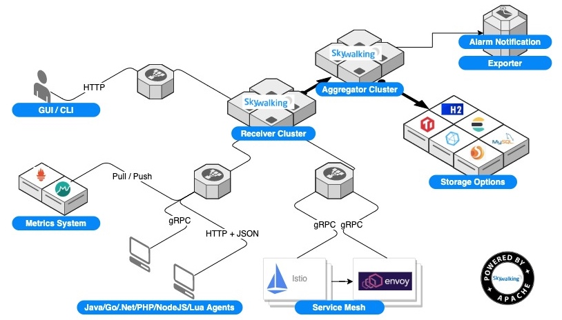

# 【分析系统】tracing

[TOC]

## 简介
tracing 指 **分布式追踪系统**，关注请求处理期间各个调用的关系和性能指标，从整体维度到局部维度来收集信息和分析问题，在 [Google Dapper](http://bigbully.github.io/Dapper-translation/) 论文中提出了对分布式跟踪系统的介绍

三种不同分析系统：[metrics、tracing and logging](http://peter.bourgon.org/blog/2017/02/21/metrics-tracing-and-logging.html?spm=a2c4e.10696291.0.0.6d2619a4LmdvS8)

## OpenTracing
OpenTracing 对于分布式追踪系统，提供与平台无关、厂商无关的 **API**（应用接口标准），以及针对特定平台的 **Instrumentation Library**（检测库），[官方网站](https://opentracing.io/)

### 术语
**Trace** 

`Trace` 是由 `Span` 隐式定义的追踪链，可看作顶点为 `Span`，边为 `References` 的有序无环图（DAG）：

```
        [Span A]  ←←←(the root span)
            |
     +------+------+
     |             |
 [Span B]      [Span C] ←←←(Span C 是 Span A 的孩子节点, ChildOf)
     |             |
 [Span D]      +---+-------+
               |           |
           [Span E]    [Span F] >>> [Span G] >>> [Span H]
                                       ↑
                                       ↑
                                       ↑
                         (Span G 在 Span F 后被调用, FollowsFrom)
```

**Span** 

`Span` 是具有开始时间和执行时长的逻辑执行单元，每个 `Span` 中封装了以下信息：
- `Operation Name`：操作名称
- `Start Timestamp`：开始时间戳
- `Finish Timestamp`：结束时间戳
- `Tags`：一组标签的集合，标签是键值对
- `Logs`：一组日志的集合，日志是携带时间戳的键值对
- `SpanContext`：跨进程传递的跟踪信息，如 trace_id、span_id，并包含了 `Baggage`，`Baggage` 是一组键值对的集合，在一个 `Trace` 的全局范围内跨进程传递数据

**References** 

`References` 表示 `Span` 间的逻辑因果关系，根据 `SpanContext` 中的信息来创建，分为 `ChildOf` 和 `FollowsFrom` 两种：
- `ChildOf` 表示父 `Span` 对子 `Span` 的结果有较强依赖
- `FollowsFrom`: 表示父 `Span` 和子 `Span` 的结果是相对独立的

### 兼容项目
兼容 OpenTracing 标准的项目：
- [SkyWalking](https://skywalking.apache.org)
- [Zipkin](https://zipkin.io)
- [Jaeger](https://www.jaegertracing.io)

项目对比：

|  | SkyWalking | Zipkin | Jaeger |
| --- | --- | --- | --- |
| 源码语言  | Java | Java | Golang |
| OpenTracing 兼容性 | 完全兼容 | 部分兼容 | 完全兼容 |
| 埋点实现 | 字节码增强 | 请求拦截 | 请求拦截 |
| 代码侵入性 | 低 | 中 | 中 |
| 性能损失 | 低 | 中 | 中 |
| 告警通知 | 支持 | 不支持 | 不支持 |
| UI 丰富度 | 高 | 中 | 中 |
| 存储选型 | ES、H2、MySQL、Sharding-Sphere、TiDB| Cassandra、ES、Mysql | Cassandra, ES、Kafka|

> H2 是 java 编写的嵌入式数据库，属于内存数据库，即数据是在内存中直接被操作的

## SkyWalking
是一个由华为开源的基于分布式跟踪的应用程序性能监控系统，支持非侵入性埋点、应用和服务依赖分析等功能

[中文文档](https://github.com/SkyAPM/document-cn-translation-of-skywalking/tree/master/docs/zh)

### 架构


架构在逻辑上分为四部分：
- 探针（Probe）：从多种来源采集和清洗数据

- 平台后端（Platform backend）：处理从探针到用户界面的数据流，包括数据接收，数据聚合分析、告警通知

- 存储（Storage）：通过插件化的接口来存放数据

- 用户界面（UI）：基于接口可视化地管理数据

观测分析平台（OAP）是架构上的平台后端，支持以下使用 gRPC 或 HTTP 协议的数据源：
- 原生 Instrument Agent，支持 Java、C#、Node.js、Go、PHP Nginx LUA 等

- 其他 tracing 系统，如 Zipkin、Jaeger、OpenCensus

- 其他 metrics 系统，如 Prometheus, Sleuth

- 服务网格框架，如 Istio/Envoy、Linkerd

OAP 所处理的不同来源数据可分为两大类：
- 追踪数据：来自原生 Instrument Agent、其他 tracing 系统

- 指标数据：来自原生 Instrument Agent、其他 metrics 系统、服务网格框架

### 部署

 