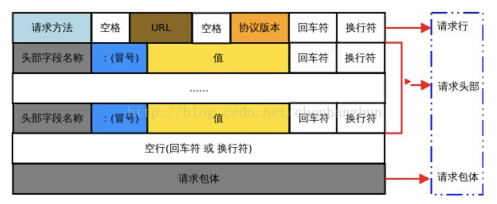
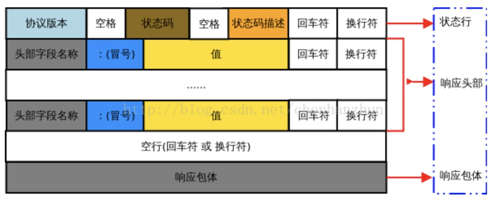

# 【基本功】http 协议

[TOC]

## 简介
http 指的是超文本传输协议（Hyper Text Transfer Protocol），基于 TCP/IP 通信协议来传递数据，目前普遍使用的版本是 HTTP 1.1

特点：
- 简单快速

客户端请求服务器时，主要是发送请求方法和路径，由于协议的简单，使得 HTTP 服务器的程序规模小，通信速度很快

- 灵活

HTTP 允许响应任意类型的数据对象，通过 `Content-Type` header 来表明其传输的内容类型

- 无连接

每次连接只处理一个请求，也就是每个请求-应答过程客户端和服务器都要新建一个连接，完成之后立即断开连接，但 HTTP 服务器程序也可以配置为 keepalive 长连接模式

- 无状态

协议对于请求处理没有记忆能力，缺少状态意味着如果后续处理需要前面的信息，则客户端必须重传。这样可能导致每次连接传送的数据量增大，但另一方面在服务器不需要先前信息时应答速度就比较快

## 请求（Request）
### 报文结构


报文共分为四个部分：
- 请求行（Request Line）

用来说明请求方法，目标 URL 以及所使用的 HTTP 版本

- 请求头部（Request Header）

紧接着请求行之后，用来说明服务器需要获取的附加信息

- 空行（Blank Line）

请求头部后面的空行是必须的，即使没有请求包体部分

- 请求包体（Request Body）

存放着任意类型的请求数据，用来提交给服务器，如 POST、PUT、PATCH 等提交数据的请求会包含该部分

实例：
``` 
GET / HTTP/1.1 
Host: www.baidu.com 
Connection: keep-alive 
Cache-Control: max-age=0 
Upgrade-Insecure-Requests: 1 
User-Agent: Mozilla/5.0 (iPhone; CPU iPhone OS 11_0 like Mac OS X) AppleWebKit/604.1.38 (KHTML, like Gecko) Version/11.0 Mobile/15A372 Safari/604.1 
Accept: text/html,application/xhtml+xml,application/xml;q=0.9,image/webp,image/apng,*/*;q=0.8 
Accept-Encoding: gzip, deflate, br Accept-Language: zh-CN,zh;q=0.9 

```

### 方法
请求方法（Request Method）用于表示了对资源进行不同的操作方式，以完成不同功能，其中：

HTTP 1.0 定义了三种请求方法： GET、POST 和 HEAD

HTTP 1.1 新增了六种请求方法：PUT、PATCH、DELETE、OPTIONS、TRACE 和 CONNECT

| 请求方法 | 描述 |
| --- | --- |
| GET  | 请求指定的资源，服务器返回完整的响应，用于资源的查询 |
| HEAD |	 请求指定的资源，服务器返回不包含包体部分的响应，用于资源的测试 |
| POST | 请求向指定资源提交数据并进行处理，一般用于资源的创建，也可能用于资源的更新或其他操作 |
| PUT | 请求向指定资源提交数据并进行取代，用于资源的更新 |
| PATCH | 请求向指定资源提交数据并进行部分内容修改，用于资源的部分更新 |
| DELETE | 请求删除指定的资源 |
| OPTIONS | 请求指定资源的支持信息，如所支持的请求方法、请求头部等，用于资源的功能查询 |
| TRACE | 请求回显，服务器返回收到的请求，用于服务器的测试或诊断 |
| CONNECT | HTTP/1.1 中预留给能够将连接改为管道方式的代理服务器 |

在实际应用中最常用的也就是 GET 请求和 POST 请求

GET 请求一般不包含 body，通过在 URL 末尾以 `?` 开头追加表示查询参数（Query Params）的字符串，以便将查询信息发送给服务器

查询参数中每个参数名和对应值都必须使用 `encodeURLComponent()` 进行编码，而且所有键值对由 `&` 分隔，如：`http://www.amazon.com/ap/signin?openid.assoc_handle=aws&openid.ns=http%3A%2F%2Fspecs.openid.net%2Fauth%2F2.0`

列表参数通过多个相同参数名分别传入不同的值来实现的

POST 请求一般包含 body，以便向提交向指定资源提交数据，数据放在 body 中

一个请求的使用哪个请求方法和是否包含查询参数或 body 没有强制限定，但是有使用规范：
- 请求资源的请求方法才会包含查询参数
- 需要向资源提交数据的请求方法才会包含 body

为什么不直接使用查询参数代替 body 来提交数据？
- 通过 body 提交数据不显式附加在 URL 中，较为安全
- 查询参数的字符串大小有限制，一般限制在 2KB

HEAD 请求指定资源时不会得到响应的 body，可以用于对资源进行以下测试：
- 判断资源类型
- 通过响应的状态码，测试资源是否存在

POST 和 PUT、PATCH 的区别：主要是在协议上语义有很大区别，POST 请求用于创建资源，是非幂等的，PUT、PATCH 请求用于更新资源，是幂等的

幂等是指相同的请求无论发生多少次，其作用结果都是一样的，因此当幂等操作没有达到预期目标时，可以不停进行重试，而不会对资源产生副作用

### 头部
header 字段名中的连接符不能使用 `_`，而是需要使用 `-` 代替，常用的 header 字段有：

| 字段 | 表示 | 实例 |
| --- | --- | --- |
| Host | 请求的服务器域名和端口 | `Host: www.example.com` |
| User-Agent | 客户端信息，是浏览器类型的重要标识 | `User-Agent: Mozilla/5.0 (Linux; X11)` |
| Accept	 | 客户端可接收的内容类型 | `Accept: text/plain, text/html` |
| Accept-Charset | 客户端可接收的内容字符集 | `Accept-Charset: iso-8859-5` |
| Accept-Encoding | 客户端可接收的内容压缩编码 | `Accept-Encoding: br, gzip, deflate` |
| Accept-Language | 客户端可接收的语言 | `Accept-Language: zh-cn` |
| Referer | 请求的来路，即浏览器所访问的前一个网页地址 | `Referer: http://itbilu.com/nodejs` |
| Content-Length | 请求的内容长度 | `Content-Length: 348` |
| Content-Type | 请求的内容类型 | `Content-Type: application/x-www-form-urlencoded` |

### 数据提交
请求是通过 body 来进行数据提交的，而 `Content-Type` header 表明请求的内容类型，即 body 所使用的编码方式，代表着不同的数据提交方式

在 Postman 中有以下常用的数据提交方式：

- x-www-from-urlencoded

最常用的数据提交方式，可以提交键值对形式的表单数据，body 所使用的编码方式和请求参数的编码方式相同，即各个键值对之间以 `&` 分隔

``` 
POST / HTTP/1.1
Host: www.test.com
Content-Type: application/x-www-from-urlencoded

arg1=a&arg2=b
```

- form-data

既可以提交键值对形式的、也可以提交键文件对形式的表单数据，body 所使用的编码方式以每条表单数据为单位，以分隔符为开头和分隔，以分隔符加 `--` 为结尾，并且在 `Content-Type` header 中附带了随机生成的分隔符

body 中的每个 `Content-Disposition` 表明了该表单数据的信息，如名字，若该数据是文件，则其 `Content-Disposition` 还包括文件名，以及存在 `Content-Type` 表明文件内容类型

``` 
POST / HTTP/1.1
Host: www.test.com
Content-Type: multipart/form-data; boundary=----WebKitFormBoundaryJ4gCBmgcSDcVqaQH

------WebKitFormBoundaryJ4gCBmgcSDcVqaQH
Content-Disposition: form-data; name="arg1"

a
------WebKitFormBoundaryJ4gCBmgcSDcVqaQH
Content-Disposition: form-data; name="arg2"

b
------WebKitFormBoundaryJ4gCBmgcSDcVqaQH
Content-Disposition: form-data; name="file1"; filename="tmp.txt"
Content-Type: text/plain


------WebKitFormBoundaryJ4gCBmgcSDcVqaQH
Content-Disposition: form-data; name="file2"; filename="tmp.gif"
Content-Type: image/gif


------WebKitFormBoundaryJ4gCBmgcSDcVqaQH--
```

和 x-www-from-urlencoded 一样，列表参数也是通过多个相同参数名分别传入不同的值来实现的

- raw

用于提交自选类型的数据，将完成编码的数据放入 body 后，body 不再进行额外的编码，在选择对应的 `Content-Type` header 来说明请求的内容类型，常用的有：
- 纯文本 `text\plain`
- Json `application/json`
- Xml `application/xml`
- Html `text\html`

```
POST / HTTP/1.1
Host: www.test.com
Content-Type: application/json

{"arg1":"a","arg2":"b"}
```

- binary

用于提交单个文件，body 为该文件的二进制数据

```
POST / HTTP/1.1
Host: www.test.com
Content-Type: application/octet-stream

6\  ̒y4    '[ ,  "   Qu  W" uq P
[Ճ X Y   Njv  U _ FT       g c b C K     -e p 
~0j+    {H     8բ4
```

## 响应（Response）
### 报文结构


报文共分为四个部分：

- 状态行（Status Line）：
    
由 HTTP 协议版本号、状态码和状态码描述组成

- 响应头部（Response Header）：
    
紧接着状态行之后，用来说明客户端器需要获取的附加信息
    
- 空行（Blank Line）：
    
请求头部后面的空行是必须的，即使没有响应包体部分

- 响应包体（Response Body）：
    
存放着任意类型的响应数据，用来返回给客户端

实例：
```
HTTP/1.1 200 OK
Date: Fri, 22 May 2009 06:07:21 GMT
Content-Type: text/html; charset=UTF-8

<html>
      <head></head>
      <body>
            <!--body goes here-->
      </body>
</html>
```

### 状态码
状态码由三位数字组成，第一位数字定义了响应的类别，总共分五种类别：
- 1xx：指示信息，表示请求已被接收，且需要继续操作
- 2xx：请求成功，表示请求已被成功接收和处理
- 3xx：重定向，表示需要进一步操作，以完成请求
- 4xx：客户端错误，表示请求包含语法错误或无法完成
- 5xx：服务端错误，表示服务器处理合法请求时发生内部错误

常见状态码：

| 状态码 | 状态码描述 | 表示 |
| --- | --- | --- |
| 100 | Continue | 继续请求，需要继续发送请求 |
| 101 | 	Switching Protocols| 切换协议，需要切换协议后继续发送请求，`Upgrade` header 表明了需要切换的协议 |
| 200 | OK | 请求成功 |
| 201 | Created | 请求成功并创建了新资源 |
| 202 | Accepted | 请求已被接收，但未处理完成 |
| 204 | Not Conntent | 请求成功，但响应不包含包体部分 |
| 206 | Partial Content | 范围请求成功，响应包体部分返回由 `Content-Range` header 指定范围的内容 |
| 301 | Moved Permanently | 永久重定向，请求应该以后都使用由 `Location` header 指定的重定向目标，非 GET、HEAD 请求不允许直接进行重定向|
| 302 | Found | 临时重定向，请求仅当次使用由 `Location` header 指定的重定向目标，非 GET、HEAD 请求不允许直接进行重定向 |
| 303 | See Other | 临时重定向，请求仅当次使用由 `Location` header 指定的重定向目标，非 GET、HEAD 请求会被改变为 GET 请求并删除请求包体 |
| 304 | Not Modified | 资源未改变，可直接使用客户端未过期的缓存 |
| 305 | Use Proxy | 请求使用由 `Location` header 指定的代理 |
| 307 | Temporary Redirect | 临时重定向，请求仅当次使用由 `Location` header 指定的重定向目标，非 GET、HEAD 不会被改变请求方法 |
| 400 | Bad Request | 请求有语法错误，不能被服务器所理解 |
| 401 | Unauthorized | 请求没有通过 HTTP 基础认证 |
| 403 | Forbidden | 请求被服务器拒绝，通常是因为权限不足等原因 |
| 404 | Not Found | 请求的资源无法在服务器上找到 |
| 405 | Method Not Allowed | 请求方法不被服务器允许 |
| 409 | Conflict | 请求的资源和其当前状态之间存在冲突，无法完成 |
| 429 | Too Many Requests | 发出的请求次数太多 |
| 431 | Request Header Fields Too Large | 请求 header 字段太大 |
| 500 | Internal Server Error | 服务器内部发生错误，如配置错误 |
| 502 | Bad Gateway | 作为网关或者代理工作的服务器尝试执行请求时，从上游服务器接收到无效的响应 |
| 503 | Service Unavailable | 临时的服务器维护或者过载，无法处理请求 |
| 504 | Gateway Timeout | 作为网关或者代理工作的服务器尝试执行请求时，未能及时从上游服务器或者辅助服务器（如 DNS ）收到响应 |
| 505 | HTTP Version Not Supported | 服务器不支持，或者拒绝支持在请求中使用的 HTTP 版本 |

### 头部

| 字段 | 表示 | 实例 |
| --- | --- | --- |
| Connection | 当前连接的期望状态，如保持连接或关闭 | `Connection: Keep-Alive· |
| Content-Encoding | 响应的内容编码方式 | `Content-Encoding: gzip` | 
| Content-Type | 响应的内容类型和字符集 | `Content-Type: text/html; charset=UTF-8` |
| Content-Disposition | 对响应的内容类型的补充，浏览器可根据该值决定对内容的处理方式，如下载或打开 |	`Content-Disposition: attachment; filename="fname.ext"` |
| Content-Language | 响应的内容所使用的语言 | `Content-Language: zh-cn` |
| Content-Length	| 响应的内容长度，用 8 进制字节数表示 | `Content-Length: 348` |
| Date | 响应被发送时的日期时间 | `Date: Mon, 08 Jun 2020 02:24:51 GMT` |
| Location | 用于重定向，或定位新资源创建后的地址 | `Location: http://example.com/nodejs` |
| Refresh| 用于重定向，或定位新资源创建后的地址，默认会在 5 秒后刷新并重定向 | `Refresh: 5; url=http://itbilu.com` |
| Server	 | 服务端的信息 | `Apache/2.4.17 (Unix) OpenSSL/1.0.1e-fips` |


